# DAMS — Dealer Activity Management System

Replaces Excel-based service-station bookkeeping for truck dealerships — receipts,
expenses, cash tracking, warranty/AMC claims — with a small, correct, auditable
**multi-tenant SaaS** system.

Tally remains the accounting system of record. DAMS is not accounting software — it is
the clean, verified, ledger-tagged pipe that feeds accountants, plus the owner's live
window into branch operations.

> **Spec:** `AGENT.md` is the rulebook (roles, tenancy, ID scheme, closing rules).
> **Build log:** `plan.md` is the chronological changelog (rev 1 → rev 28+).
> **Value-adds:** `docs/VALUE_ADDITIONS.md` details FEAT-01 → FEAT-21.
> **Deploy:** `docs/deployment-guide.md` + `compose.prod.yml` + `deploy/`.
> This README explains **how everything works, end to end, with flow diagrams**.

---

## Table of contents

1. [System overview & architecture](#1-system-overview--architecture)
2. [Tech stack (fixed)](#2-tech-stack-fixed)
3. [Roles & what each role sees](#3-roles--what-each-role-sees)
4. [Multi-tenancy & security pipeline](#4-multi-tenancy--security-pipeline)
5. [Core data model](#5-core-data-model)
6. [ID scheme & the clubbing principle](#6-id-scheme--the-clubbing-principle)
7. [Document lifecycles (the money flows)](#7-document-lifecycles-the-money-flows)
8. [Cash page, drawer math & day-close](#8-cash-page-drawer-math--day-close)
9. [Review queues, maker-checker & overrides](#9-review-queues-maker-checker--overrides)
10. [Claim closing (Warranty / AMC / CG)](#10-claim-closing-warranty--amc--cg)
11. [Masters, receivers, org settings](#11-masters-receivers-org-settings)
12. [Universal search, My Entries & fix-and-resubmit](#12-universal-search-my-entries--fix-and-resubmit)
13. [Owner dashboard (what counts, what doesn't)](#13-owner-dashboard-what-counts-what-doesnt)
14. [Attachments (R2 / local)](#14-attachments-r2--local)
15. [Exports (Tally / CSV)](#15-exports-tally--csv)
16. [AI assistant module (read-only)](#16-ai-assistant-module-read-only)
17. [Help Center](#17-help-center)
18. [Full API map](#18-full-api-map)
19. [Frontend map (routes, screens, API clients)](#19-frontend-map-routes-screens-api-clients)
20. [Backend layout & migrations](#20-backend-layout--migrations)
21. [Prerequisites & first-time setup](#21-prerequisites--first-time-setup)
22. [Run the app](#22-run-the-app)
23. [Auth, seeded logins & Swagger](#23-auth-seeded-logins--swagger)
24. [Tests](#24-tests)
25. [Reset / re-seed the database](#25-reset--re-seed-the-database)
26. [Configuration reference](#26-configuration-reference)
27. [Docker & CI/CD](#27-docker--cicd)
28. [Debuggability & maintainability rules](#28-debuggability--maintainability-rules)
29. [UI reference mockups](#29-ui-reference-mockups)
30. [Reverification smoke checklist (per role)](#30-reverification-smoke-checklist-per-role)
31. [Troubleshooting](#31-troubleshooting)
32. [Repo layout](#32-repo-layout)
33. [Glossary](#33-glossary)

---

## 1. System overview & architecture

One shared Postgres (Neon, hosted) during the test phase. Backend + frontend are
Docker images built by CI and pulled on the host. Attachments live in Cloudflare R2
(or local disk in dev) behind a swappable `StorageService`.

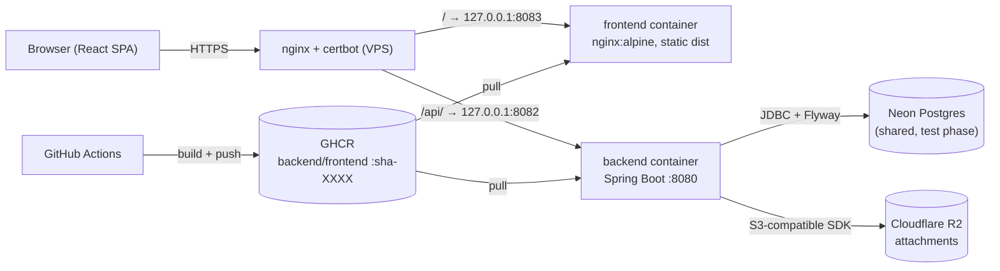

Local dev is the same shape minus nginx/GHCR: `dams.bat` or `docker compose up`
runs backend `:8080` + frontend (`:2314` via bat, `:5173` via compose) against Neon.

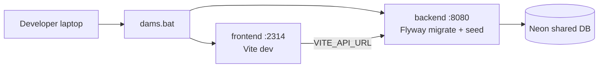

---

## 2. Tech stack (fixed — do not substitute)

| Layer | Choice |
|---|---|
| Backend | Java 21, Spring Boot 3.x, Maven; Web, Data JPA, Security (JWT, stateless), Validation, Flyway |
| DB | PostgreSQL (Neon hosted, shared instance in test phase) |
| Frontend | React 18 + Vite 5 + TypeScript 5, Tailwind 3, shadcn-style `ui.tsx`, lucide-react, recharts, react-router 7, axios |
| Attachments | Cloudflare R2 via S3-compatible SDK behind `StorageService` interface (provider swappable; `local` filesystem in dev) |
| API docs | springdoc-openapi from annotations (`/swagger-ui.html`, `/api-docs`), never hand-maintained |
| API base | `/api/v1`, plural nouns (`POST /receipts/{id}/verify`, `/approve`, `/query`, `/reject`, `/close`) |
| Images | Backend: Maven build stage → slim JRE runtime. Frontend: Node build stage → nginx serve |
| CI/CD | GitHub Actions: PR = build+test; merge to `main` = build+push to GHCR; deploy = pull+run (provider-agnostic) |

---

## 3. Roles & what each role sees

Five levels, no role-switch toggle anywhere. JWT role + `org_id` drives every view.
`/login` is the only unauthenticated route (plus `/accept-invite`).

| Role | Scope | Can do | Cannot do | Lands on |
|---|---|---|---|---|
| `SUPER_ADMIN` | Platform, `org_id = null` | List orgs, onboard org + first Owner via email invite, activate/deactivate, delete org (+ all data) | See any org's transactions by default | `/app/organizations` |
| `OWNER` | One org, all its branches | All branches read; add branches/users, assign roles + branch access; Masters CRUD; org settings; dashboards; Override Audit | Edit transactions (read-only) | Dashboard |
| `FINANCE_MANAGER` | One org, all branches | Final approval on every entry; close Warranty/AMC/CG claims with final override (locked, permanent) | — | Approvals & Claims |
| `ACCOUNTANT` | Assigned branches only | Verify submitted entries; provisional amount overrides; query/reject with reason; close Expense docs explicitly; set a branch's first-ever cash opening | Verify/approve anything they created or last modified | Review Queue |
| `CASHIER` | Exactly one home branch | Create Receive + Expense entries; Add Payment to existing job cards; cash In/Out; daily cash closing; fix-and-resubmit queried entries | Post outside home branch; verify/approve | Cashier home |

Role → branch visibility is enforced server-side by `BranchScope` (DB-fresh, not JWT):

- Owner / FM → all branches (org-wide, always).
- Accountant → `user_branch_access` set only.
- Cashier → home branch only, **unless** org setting `multi_branch_cashier_access = ON`
  (default OFF) widens *search/visibility* — posting still stays on the home branch.

---

## 4. Multi-tenancy & security pipeline

**Approach: shared database, shared schema, `org_id` on every tenant-scoped table.**
Every repository query filters by the authenticated user's `org_id`. Enforcement is
structural (Hibernate `@Filter`), not convention.

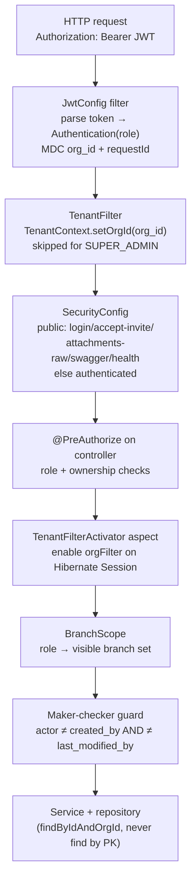

Key files:

- `auth/util/JwtUtil.java` — single ~8h access JWT (`sub=userId`, `orgId`, `role`,
  `branchIds[]`, `homeBranchId`). No refresh token in v1 (deliberate: testers switch
  accounts constantly; hardening is post-sign-off).
- `config/JwtConfig.java` — `OncePerRequestFilter`, sets `SimpleGrantedAuthority(role)`.
- `config/TenantContext.java` — `ThreadLocal<Long>`, always cleared in `finally`.
- `config/TenantFilterActivator.java` — enables `orgFilter` on every repository call.
- `common/security/BranchScope.java` — branch visibility per role (see §3).
- `review/service/ReviewGuard.java` — accountant/FM branch + maker-checker checks.
- `common/filter/RequestIdFilter.java` + `logging.pattern.console` — every log line
  carries `requestId` + `org_id` + `branch_id` + document/line ID; every API error
  echoes the same `requestId`.

Super Admin endpoints (`admin/controller/AdminOrgController`) are the **only**
cross-org exception and live in their own package so the exception is visible.
`CrossOrgIsolationTest` (Testcontainers) proves isolation; it must stay green.

Document numbers are **unique per-org, never globally**: unique constraint on
`(org_id, document_no)`; PK is a surrogate `BIGINT IDENTITY` never shown to users.

---

## 5. Core data model

Clubbing principle: **one cause = one document with many sub-transaction lines.**

- Receive Document (`DAMS-Receive-ID`) ← many Settlement Lines
- Expense Document (`DAMS-Expenses-ID`) ← many Expense Lines
- Cash Document (`-C-`) is a single-amount movement with **no** sub-lines

Dependency order:

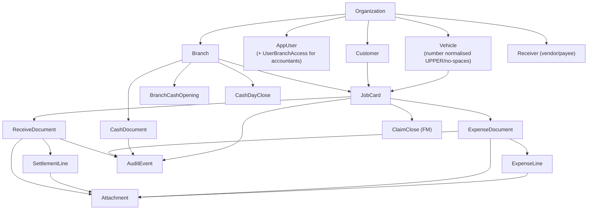

Entity → table highlights (all from `Branch` down carry `org_id`):

| Entity | Table | Key fields |
|---|---|---|
| `Organization` | `organization` | `name`, `multiBranchCashierAccess` (default false), `active` |
| `Branch` | `branch` | `orgId`, `code` (5-char, e.g. `OOR`), `name`, `active` |
| `DocumentSequence` | `document_sequence` | `(org, branch, monthKey YYYYMM, docType R/E/C)` → `lastSeq` (gap-free) |
| `AppUser` | `app_user` | `orgId` (null for Super Admin), `homeBranchId`, `name`, `email` unique, `passwordHash`, `role`, `inviteToken/ExpiresAt` |
| `Customer` / `Vehicle` / `Receiver` | `customer` / `vehicle` / `receiver` | `orgId`, `name`; vehicle `vehicleNo` unique per org |
| `JobCard` | `job_card` | `orgId`, `branchId`, `customerId`, `vehicleId?`, `dbmId?` (Eicher external ref, nullable), `invoiceNo?`, `invoiceAmount?`, `isB2b`, `gstNo?`, `categoryId`, `businessStatusId` |
| `ReceiveDocument` | `receive_document` | `documentNo`, `workflowStatus` (DRAFT/SUBMITTED/VERIFIED/APPROVED/QUERIED/REJECTED), `lineNoSeq`, `createdBy/lastModifiedBy` |
| `SettlementLine` | `settlement_line` | `lineNo`, `lineId {doc}-L{n}`, `transactionDate`, `settlementModeId`, `amount`, override cols, `bankId?`, `transactionRef?`, `remark` |
| `ExpenseDocument` | `expense_document` | + `receiverId`, `expenseCategoryId`, `businessStatusId`, `overLimit`, optional `jobCardId` |
| `ExpenseLine` | `expense_line` | + `subCategoryId`, `expenseModeId` |
| `CashDocument` | `cash_document` | `documentNo -C-`, `direction IN/OUT`, single `amount`, no lines |
| `BranchCashOpening` | `branch_cash_opening` | one per branch ever (Accountant sets first-ever) |
| `CashDayClose` | `cash_day_close` | `countedAmount`, `computedClosing`, `variance`, `varianceRemark` (mandatory if ≠ 0) — locks the date |
| `ClaimClose` | `claim_close` | `jobCardId`, `finalAmount`, `overridden?`, `overrideReason`, `closedBy/At` — immutable |
| `Attachment` | `attachment` | `parentType`, `parentId`, `objectKey`, `filename`, `contentType`, `sizeBytes` |
| `AuditEvent` | `audit_event` | `entityType`, `entityId`, `branchId`, `eventType`, `actorType`, `detail` JSON |
| Masters | 8 tables | extend `OrgMaster` (`name`, `active`, `sortOrder`); deactivate, never delete |

Masters catalogue (every dropdown comes from these, never hard-coded):
receive categories (11, incl. claim flags), receive business statuses, settlement modes
(`is_cash`, `requires_bank/ref`), expense categories + sub-categories
(`limit_amount`), expense modes (`is_cash`, `requires_bank/ref`), expense business
statuses (`triggers_claim`), banks. Seeded values for a new/demo org (V5 —
`MasterProvisioningService` copies the same set for every onboarded org):

| Master type | Seeded values |
|---|---|
| Receive categories (11) | Workshop, Breakdown, Advance, Spare / Counter, AdBlue Bucket, AdBlue Barrel, **AMC · Warranty · Goodwill** (`is_claim = true` → FM claim-close), B2B Credit, Scrap / Used Lubes / Other |
| Receive business statuses (7) | Hold, AMC, CG, WIP, Warranty, Credit, Close |
| Settlement modes (7) | Cash, QR / UPI, Bank, Card, Adv-QR, Adv-Cash, Credit (Due). Cash-mode (`is_cash`, drives drawer math): **Cash, Adv-Cash**. Reference required (`requires_ref`): QR / UPI, Bank, Adv-QR. Bank required (`requires_bank`): Bank |
| Expense categories (4) | Service, Sales, Showroom, Finance |
| Expense sub-categories (13, with per-line limits) | Service: Food (BD) ₹500, Spare Transport ₹1,000, Taxi (JC) ₹2,000, Fuel (JC) ₹1,000, Local Purchase (JC) ₹2,000, Courier ₹500 · Showroom: Stationary ₹1,500, Misc. Office ₹2,000, Site Repair ₹5,000, Daily Wages ₹5,000 · Sales: Sales Promotion ₹5,000, RTO ₹3,000, Misc. Sales ₹2,000 |
| Expense modes (3) | Cash (`is_cash`), QR / UPI, Bank |
| Expense business statuses (6) | Open, In Progress, Awaiting Receipt, Received Receipt, Closed, **Transfer to Claim** (`triggers_claim`) |
| Banks (6) | State Bank of India, HDFC Bank, ICICI Bank, Axis Bank, Bank of Baroda, Punjab National Bank |

---

## 6. ID scheme & the clubbing principle

| ID | Format | Example | Rule |
|---|---|---|---|
| `DAMS-Receive-ID` | `{branchPrefix}-{MMMYY}-{R}-{seq:03d}` | `OOR-JUL26-R-021` | Server-generated **on submit only** (drafts unnumbered), gap-free per branch/month/type via `INSERT … ON CONFLICT … DO UPDATE … RETURNING` in the submit txn. Never editable |
| `DAMS-Expenses-ID` | `{branchPrefix}-{MMMYY}-{E}-{seq:03d}` | `OOR-JUL26-E-001` | Same machinery as Receive |
| Cash doc | `{branch}-{MMMYY}-C-{seq}` | `OOR-JUL26-C-005` | Single-amount, no lines |
| Line ID | `{document_no}-L{n}` | `OOR-JUL26-R-021-L1` | Monotonic `line_no_seq`, never reused even if a line is voided (V22) |
| Job card ref | `{branchCode}-JC-{id}` | `OOR-JC-5` | Derived at read time, no stored number |
| DBM ID / Job Card no. | free text, nullable | — | Eicher's external ref, manual entry; never an internal key |

Vehicle number is normalised (uppercase, no spaces) and is the natural key for the
Vehicle master. DAMS's own JobCard ID is the true anchor linking a vehicle/customer
to all their documents over time — never DBM ID, never vehicle number directly.

---

## 7. Document lifecycles (the money flows)

Three distinct closing behaviours — do not conflate them:

1. **Regular receipts close themselves.** No explicit close. Open until Pending Amount
   = 0, then status flips to settled automatically. Accountant verification does NOT close.
2. **Expenses are closed explicitly by the Accountant** (`POST /expenses/{id}/close`):
   Open → In Progress → Awaiting Receipt → Received Receipt → Closed (or Transfer to Claim).
   An over-limit expense needs FM `APPROVED` first.
3. **Warranty/AMC/CG claims are closed explicitly by the Finance Manager**
   (`POST /job-cards/{id}/close-claim`), with a final override that is permanent and
   shown as **"Overridden · Final"** everywhere.

Pending Amount (the one implementation: `PendingAmountCalculator`) =
`invoice − Σ lines across the job card's non-REJECTED receive docs`;
0 when no invoice yet, 0 once a `ClaimClose` exists (shortfall must never resurface
as a phantom balance).

Worked example: job card `OOR-JC-5`, invoice ₹12,000. Cashier submits `OOR-JUL26-R-021`
with lines ₹5,000 + ₹4,000 → pending = 12,000 − 9,000 = **₹3,000**, receipt stays open.
Driver pays ₹3,000 via Add Payment (appended as `-L3` on the same doc) → pending **₹0**
→ receipt auto-settles (SYSTEM `SETTLED` audit, receipts freeze). If instead the FM
closes it as a warranty claim at final ₹10,000 with a reason, pending reads **₹0** via
the claim close and the record shows **Overridden · Final** — the ₹2,000 shortfall
never reappears as a balance.

Document-number sequence example (branch `OOR`, July 2026): first receipt submitted →
`OOR-JUL26-R-001`, next → `-R-002`, first expense → `OOR-JUL26-E-001`, first cash
movement → `OOR-JUL26-C-001`. August restarts at `-001` (`OOR-AUG26-R-001`). Drafts
hold no number, so cancelled drafts leave no gaps.

**Add Payment always appends a line to the existing open Receive Document** for that
job card — it never creates a second document (a real prototype bug, now guarded by
a one-open-doc index that excludes REJECTED, V21).

### 7.1 Receive (receipt) lifecycle

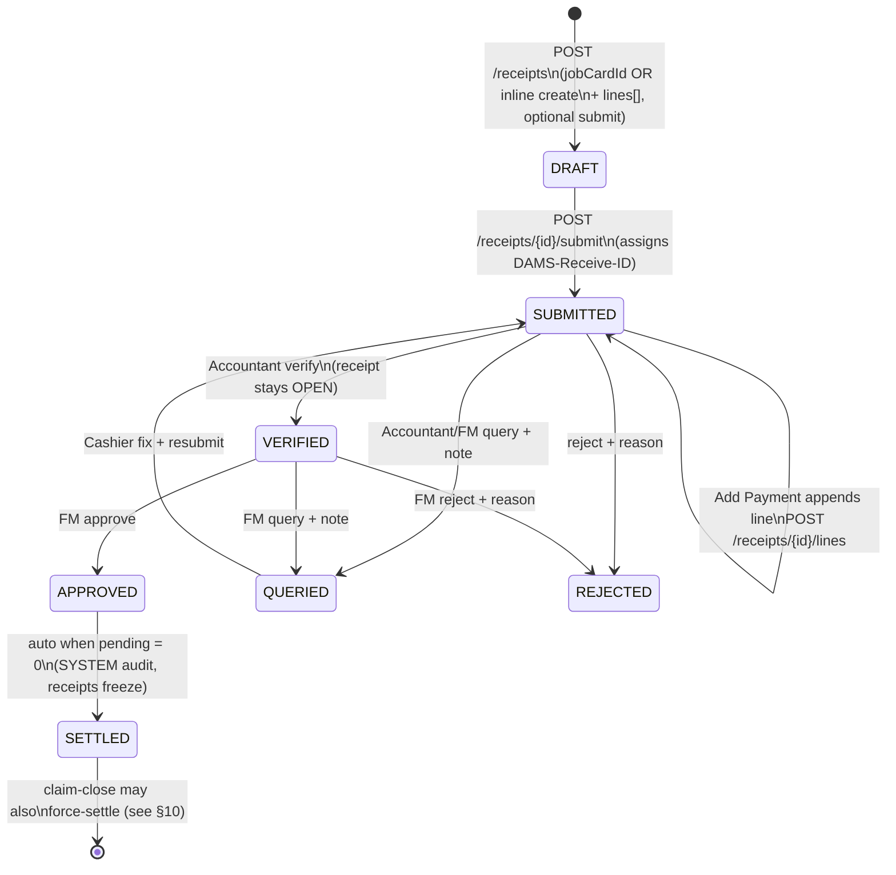

- Cashier writes only in own home branch (409 otherwise, naming both branches).
- Lines editable while DRAFT/QUERIED; `PATCH /lines/{lineNo}`, `DELETE /lines/{lineNo}`.
- Query sets `QUERIED` (not SUBMITTED) so the resubmit loop is explicit.
- `GET /receipts/{id}` is branch-scoped for every role + carries a `history` array.

### 7.2 Expense lifecycle

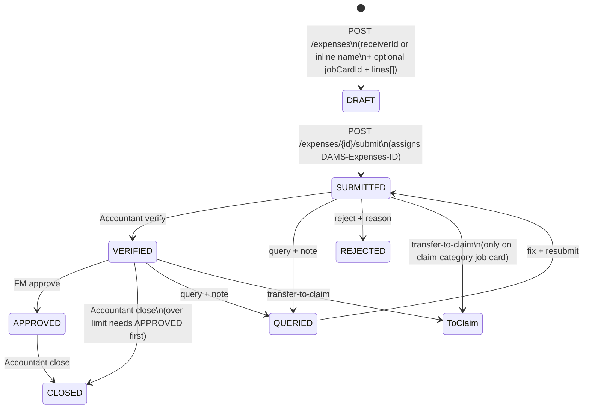

- `over_limit` recomputed on every line change (`amount > sub_category.limit_amount`) —
  flags for FM, never blocks.
- Lines stay addable until `CLOSED` (Add Expense allowed until Accountant closes).
- New Expense always creates a fresh document (no one-open invariant — that exists
  only on the receive side to keep Pending unambiguous).
- `transfer-to-claim` only when the expense sits on a warranty/AMC/goodwill job card
  (`receive_category.is_claim`); sets the `triggers_claim` business status.

### 7.3 Onboarding (Super Admin → Owner)

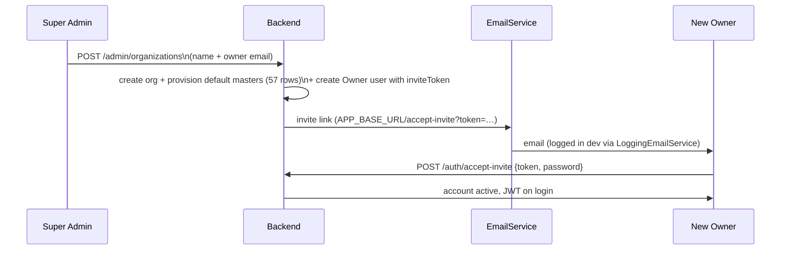

### 7.4 Request pipeline per call

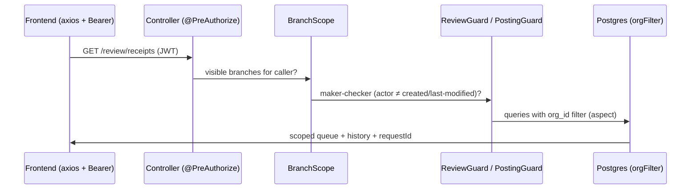

---

## 8. Cash page, drawer math & day-close

Dedicated cashier screen per branch per day — internal money movement only
(In from Bank / Out to Bank). No customer/vehicle/job-card fields. Same
maker-checker chain (Submitted → Verified → Approved). Excluded from Collections
and Expenses KPIs everywhere — affects drawer math only.

Drawer position (the one implementation: `DrawerService`):

```text
drawer = Opening + cash-mode receipts + Cash IN − cash-mode expenses − Cash OUT
```

- `Opening` = previous day's approved `counted_amount`, else the Accountant's one-time
  `POST /cash/opening`, else 0 with `openingSet = false` (first-ever opening is
  Accountant-only).
- Counts every non-DRAFT, non-REJECTED contributor (cash is physically in the drawer
  regardless of review state).

Worked example (branch `OOR`, today): opening ₹20,000 (yesterday's close) + cash-mode
receipt lines ₹35,000 + Cash IN from bank ₹50,000 − cash-mode expense lines ₹8,000 −
Cash OUT to bank ₹40,000 = **₹57,000** computed. Cashier counts ₹56,700 → variance
**−₹300** → remark mandatory ("short: auto fare, bill attached") → Close locks the date.
UPI/Bank-mode lines never enter this math, wherever they appear.

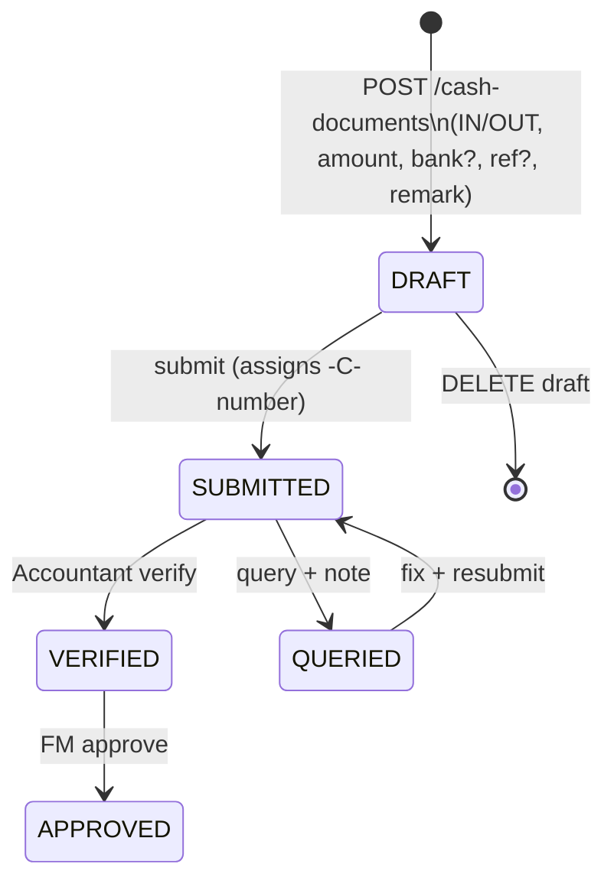

End-of-day Close Cash on the same page:

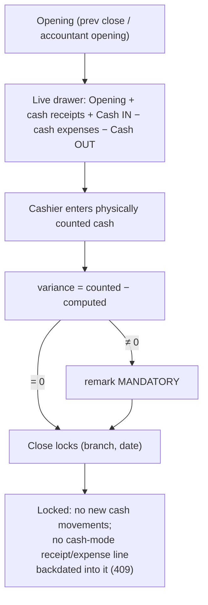

Cash In/Out sub-categories under expenses are removed — fully replaced by this page.

---

## 9. Review queues, maker-checker & overrides

| Queue | Who | What |
|---|---|---|
| `GET /review/receipts\|expenses\|cash` | Accountant | SUBMITTED docs in assigned branches |
| `GET /review/fm/receipts\|expenses\|cash` | FM | VERIFIED awaiting approval + (receipts) open claims + recently closed |
| `POST …/verify` | Accountant | SUBMITTED → VERIFIED |
| `POST …/approve` | FM | VERIFIED → APPROVED |
| `POST …/query` (note) / `/reject` (reason) | Accountant (from SUBMITTED), FM (from VERIFIED) | → QUERIED / REJECTED |
| `POST …/lines/{lineNo}/override` | Accountant (provisional) / FM | `{amount, reason}` → stamps `original_amount`, `overridden_by/at`, writes `OVERRIDE` audit row, recomputes `over_limit` / re-runs auto-settle |
| `POST /expenses/{id}/close` | Accountant | Explicit expense close |
| `POST /receipts|expenses/bulk-verify` | Accountant | Multi-select bulk verify (skips maker-checker violations) |

**Maker-checker:** a user never verifies/approves an entry they created or last
modified. Review actions don't touch `last_modified_by` (it tracks the maker's last
edit), so one accountant can override a line and still verify the same document.

Who may do what (enforced by `@PreAuthorize` + `ReviewGuard`, not by the UI):

| Action | Cashier | Accountant | FM | Owner |
|---|---|---|---|---|
| Create / edit (own home branch) | ✅ | ❌ | ❌ | ❌ (read-only) |
| Verify (SUBMITTED → VERIFIED) | ❌ | ✅ own-branch only | ❌ | ❌ |
| Approve (VERIFIED → APPROVED) | ❌ | ❌ | ✅ | ❌ |
| Query / Reject (with note/reason) | ❌ | ✅ from SUBMITTED | ✅ from VERIFIED | ❌ |
| Line override (amount + reason) | ❌ | ✅ provisional | ✅ | ❌ |
| Close Expense explicitly | ❌ | ✅ (over-limit needs APPROVED first) | ❌ | ❌ |
| Close claim (final override) | ❌ | ❌ | ✅ | ❌ |
| Set first-ever branch opening | ❌ | ✅ | ❌ | ❌ |
| Masters / users / branches / org settings writes | ❌ | ❌ | ❌ | ✅ |
| Onboard orgs | ❌ | ❌ | ❌ | ❌ (Super Admin only) |

Every row above is additionally gated by maker-checker (actor ≠ `created_by` and ≠
`last_modified_by`) and by branch scope (§3).

**Override Audit** (`GET /override-audit`, Owner + FM, filterable by user/branch/date):
one feed merging Accountant line overrides (`OVERRIDE` audit rows: who/when/
original → new/reason/doc-line) and FM claim-close overrides (`kind: "claim"`).

---

## 10. Claim closing (Warranty / AMC / CG)

FM-only, explicit, final. `POST /job-cards/{id}/close-claim { finalAmount, reason? }`.

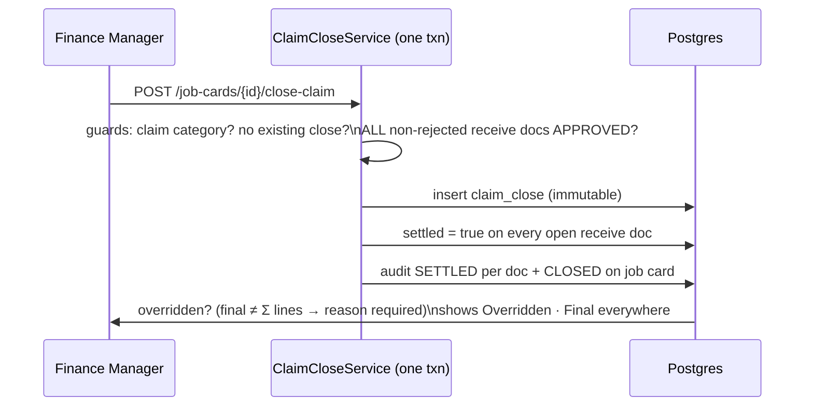

Post-close locks: `PATCH /job-cards` category/status → 409, `POST /receipts` → 409,
`pending_amount` = 0. After close the FM queue shows the claim under recently-closed.

OEM aging buckets (FM queue + Owner outstanding): `0–30d` Normal, `31–60d` Follow-up,
`61–90d` Escalate, `90+d` Critical.

---

## 11. Masters, receivers, org settings

- `GET /masters/{type}`, `GET /masters/{type}/{id}` — any signed-in org user.
- `POST /masters/{type}`, `PATCH /masters/{type}/{id}` — Owner only.
- Deactivate, never delete (`active` flag). New orgs are auto-provisioned with the
  full catalogue (57 rows) so dropdowns work on day one.
- `expense_sub_category.limit_amount` drives the `over_limit` flag; `settlement_mode`
  / `expense_mode` flags (`is_cash`, `requires_bank/ref`) drive drawer math and form
  validation — the app asks the mode, never matches its name.
- Receivers (vendors/payees): same pattern at `/receivers` — deduped by name like
  Customer, because a name alone isn't a safe key.
- Org settings: `GET /organization`, `PATCH /organization` (Owner) — includes the
  `multi_branch_cashier_access` toggle (default OFF).

---

## 12. Universal search, My Entries & fix-and-resubmit

**Universal search** (`GET /search?q=`, every role): name / phone / vehicle / job card /
invoice / DBM / document_no (receive + expense). Always scoped by the caller's branch
access (+ cashier toggle). Name/phone/vehicle matches are org-wide (those masters
aren't branch-scoped); job-card/invoice/doc dimensions are branch-filtered. Frontend:
cashier home search + a fixed-width box on reviewer/owner title rows opening a
read-only customer drawer (totals, job cards, payment timeline, View documents).

**My Entries** (`GET /my-entries`): the cashier's own entries, today + recent, merged
across receipts + expenses + cash (`kind` = RECEIPT/EXPENSE/CASH). Queried items are
highlighted, open in edit mode (`?editDoc=`), and Resubmit returns them to SUBMITTED.
Same append-while-open rule: receipt lines append while open; expense lines until
Accountant closes.

---

## 13. Owner dashboard (what counts, what doesn't)

`GET /dashboard/summary|outstanding|activity` (Owner + FM).

- `summary`: KPI cards (collections / expenses / net / cash-in-hand / pending-review),
  14-day trend, collections-by-mode, expenses-by-category, per-branch comparison.
- **Money counts APPROVED docs only. Cash In/Out never counts as collections or
  expenses** — drawer only.
- `outstanding`: open job-card attention items + CLAIM items (open claims deduped per
  job card) + aging distribution.
- `activity`: recent audit trail feed.
- Aggregates are batched (one drawer roll-up for all branches, grouped
  pending-review / settlement-sum queries) — the dashboard went ~95 → ~25 DB
  round-trips (8.0s → 2.0s on Neon `ap-southeast-1`).

Frontend: `owner/DashboardPage.tsx` — branch + period (Today/MTD) filters, recharts
area + donut, outstanding list, activity feed, cash-variance / unclosed-day banners,
Ask DAMS panel, AI insights hub.

---

## 14. Attachments (R2 / local)

Every settlement line, every expense line, and the parent document itself can carry a
PDF/image receipt. Stored in Cloudflare R2 (or local disk in dev) via `StorageService`;
referenced from Postgres by object key + `org_id`; served via short-lived signed URLs,
never public links. UI is a **"View Receipts" button opening on click** (lightbox with
zoom/rotate/fullscreen) — not inline thumbnails. Multi-file drag-and-drop on upload.

- Limits: 10 MB/file, PDF or image (backend + nginx `client_max_body_size 15m` must
  move together).
- Frozen (no replace/delete) once the parent is Approved/settled/Closed; row-level
  freeze on approve; branch access honoured on upload/list/signed-URL/delete.
- Local dev: bytes on disk (`DAMS_STORAGE_LOCAL_DIR`), HMAC-signed 10-min URL from
  `GET /api/v1/attachments/raw` (public — the signature + expiry *are* the auth).
- R2: presigned GET URLs; R2/S3 types stay inside `R2StorageService` only.
- Switch: `DAMS_STORAGE_PROVIDER=local|r2` + `R2_ENDPOINT/R2_ACCESS_KEY_ID/R2_SECRET_ACCESS_KEY/R2_BUCKET`.

---

## 15. Exports (Tally / CSV)

`GET /api/v1/export/receipts|expenses` (Owner/FM/Accountant, branch-scoped) streams
RFC-4180 CSV with UTF-8 BOM for Excel/Tally bridges: customer phone, vehicle no,
canonical job-card ref, DBM ID, mode, bank, transaction ref, amounts. Frontend:
`ExportModal` (7d/30d/90d/custom + branch filter) on the Accountant queue and Owner
dashboard. (Note: AGENT.md decision #5 says no Tally export in v1 — the export
endpoints exist as FEAT-04; keep this section aligned with AGENT.md if that decision
is re-affirmed.)

---

## 16. AI assistant module (read-only)

New `com.dams.ai` module (`AiController /ai/*`, 13 endpoints) + `V20__ai_query_log`.
Deterministic rules over existing aggregates/services; the LLM sits behind the
swappable `InsightService` interface, so every endpoint works offline and in tests.

- `POST /ai/ask` (multi-turn, session-only; doc-lookup intent resolves names like
  `OOR-JUL26-R-021` to real status/lines/total, out-of-scope reads as not found),
  `GET /ai/brief|benchmark|anomalies|risk|queries/roots|claims/insights|cash/advice|close/checklist|receivers/duplicates|masters/health|limits/advice|search`.
- Guards preserved: JWT `org_id` + `BranchScope` on every method; Owner stays read-only;
  answers cite only real doc numbers; the module's **only** write is the `ai_query_log`
  trace row (`org_id, user_id, question, doc_ids_cited, request_id`).
- Frontend: `AskDamsPanel` (dashboard dock + `Ctrl/⌘+K`), `AiInsightsSection` hub,
  `AiMastersStrip`, `AiClaimBanner`, `AiRiskBadge` pills, smart-search fallback.
- See `docs/VALUE_ADDITIONS.md` §3 (FEAT-09 → FEAT-21) for per-feature why/where.

---

## 17. Help Center

`? Help` in the shell header opens a right-side drawer: search + role-scoped table of
contents + Markdown articles bundled from `frontend/src/help/<role>/*.md`
(`help/manifest.ts` fixes order + titles). No backend, no migration. Text-only by
design (owner decision: no screenshots). Per-screen `HelpButton` deep-links to the
relevant article. 24 articles: cashier ×8, accountant ×5, finance-manager ×4,
owner ×5, super-admin ×2.

---

## 18. Full API map

All paths prefixed `/api/v1`. Auth: Bearer JWT (`JwtConfig`). Public only:
`/auth/login`, `/auth/accept-invite`, `/attachments/raw` (sig+exp are the auth),
`/swagger-ui.html`, `/swagger-ui/**`, `/api-docs/**`, `/actuator/health`
(see `SecurityConfig#filterChain`). Docs come from annotations (`@Operation`/`@Tag`) —
check Swagger UI when in doubt.

| Area | Controller | Routes |
|---|---|---|
| Auth | `auth/controller/AuthController` | `POST /auth/login`, `POST /auth/accept-invite`, `POST /auth/change-password` |
| Admin (cross-org exception) | `admin/controller/AdminOrgController` | `GET\|POST /admin/organizations`, `GET\|PATCH\|DELETE /admin/organizations/{id}` |
| Branches | `branch/controller/BranchController` | `GET /branches`, `GET /branches/{id}`, `POST /branches`, `PATCH /branches/{id}` |
| Users | `user/controller/UserController` | `GET /users`, `GET /users/{id}`, `POST /users`, `PATCH /users/{id}` |
| Org settings | `organization/controller/OrgSettingsController` | `GET /organization`, `PATCH /organization` |
| Masters | `masters/controller/MastersController` | `GET /masters/{type}`, `GET /masters/{type}/{id}`, `POST /masters/{type}` (Owner), `PATCH /masters/{type}/{id}` (Owner) |
| Receivers | `receiver/controller/ReceiverController` | `GET /receivers`, `GET /receivers/{id}`, `POST /receivers`, `PATCH /receivers/{id}` |
| Customers | `customer/controller/CustomerController` | `GET /customers`, `GET /customers/{id}`, `GET /customers/{id}/history`, `POST /customers`, `PATCH /customers/{id}` |
| Vehicles | `vehicle/controller/VehicleController` | `GET /vehicles`, `POST /vehicles` (lookup + deduped create; number normalised) |
| Job cards | `jobcard/controller/JobCardController` | `POST /job-cards` (existing or inline customer/vehicle create), `GET /job-cards/{id}` (derived `{branchCode}-JC-{id}`), `PATCH /job-cards/{id}` (invoiceNo, invoiceAmount/clear, vehicleNo, dbmId, b2b, gstNo, categoryId, businessStatusId), `POST /job-cards/{id}/close-claim` (FM) |
| Receipts | `receive/controller/ReceiveDocumentController` | `POST /receipts`, `GET /receipts/{id}`, `POST /receipts/{id}/submit`, `POST /receipts/{id}/resubmit`, `POST /receipts/{id}/lines`, `PATCH /receipts/{id}/lines/{lineNo}`, `DELETE /receipts/{id}/lines/{lineNo}`, `POST\|GET /receipts/{id}/attachments`, `POST\|GET /receipts/{id}/lines/{lineNo}/attachments` |
| Expenses | `expense/controller/ExpenseDocumentController` | `POST /expenses`, `GET /expenses/{id}`, `PATCH /expenses/{id}`, `POST /expenses/{id}/submit`, `POST /expenses/{id}/resubmit`, `POST /expenses/{id}/transfer-to-claim`, `POST /expenses/{id}/lines`, `PATCH /expenses/{id}/lines/{lineNo}`, `DELETE /expenses/{id}/lines/{lineNo}`, `POST\|GET /expenses/{id}/attachments`, `POST\|GET /expenses/{id}/lines/{lineNo}/attachments` |
| Cash docs | `cash/controller/CashDocumentController` | `POST /cash-documents`, `GET /cash-documents`, `GET /cash-documents/{id}`, `PATCH /cash-documents/{id}`, `POST /cash-documents/{id}/submit`, `POST /cash-documents/{id}/resubmit`, `DELETE /cash-documents/{id}` |
| Cash day | `cash/controller/CashController` | `GET /cash/drawer`, `POST /cash/opening`, `POST\|GET /cash/close-day` |
| Review | `review/controller/ReviewController` | `GET /review/receipts\|expenses\|cash`, `GET /review/fm/receipts\|expenses\|cash`, `POST /receipts/{id}/verify\|query\|reject`, `POST /receipts/bulk-verify`, `POST /receipts/{id}/lines/{lineNo}/override`, `POST /receipts/{id}/approve`, `POST /expenses/{id}/verify\|bulk-verify\|query\|reject`, `POST /expenses/{id}/lines/{lineNo}/override`, `POST /expenses/{id}/close`, `POST /expenses/{id}/approve`, `POST /cash-documents/{id}/verify\|approve\|query\|reject` |
| Search | `search/controller/SearchController` | `GET /search?q=` |
| AI assistant | `ai/controller/AiController` | `POST /ai/ask`, `GET /ai/brief`, `GET /ai/benchmark`, `GET /ai/anomalies`, `GET /ai/risk`, `GET /ai/queries/roots`, `GET /ai/claims/insights`, `GET /ai/cash/advice`, `GET /ai/close/checklist`, `GET /ai/receivers/duplicates`, `GET /ai/masters/health`, `GET /ai/limits/advice`, `GET /ai/search` (all read-only; only write is `ai_query_log` trace row) |
| My Entries | `myentries/controller/MyEntriesController` | `GET /my-entries` |
| Dashboard | `dashboard/controller/DashboardController` | `GET /dashboard/summary`, `GET /dashboard/outstanding`, `GET /dashboard/activity` |
| Override audit | `audit/controller/OverrideAuditController` | `GET /override-audit` (Owner+FM, filterable user/branch/date) |
| Attachments | `attachment/controller/AttachmentController` | `GET /attachments/{id}`, `DELETE /attachments/{id}`, `GET /attachments/raw` (public w/ signature) |
| Export | `export/controller/ExportController` | `GET /export/receipts`, `GET /export/expenses` |

---

## 19. Frontend map (routes, screens, API clients)

Stack: React 18 + Vite 5 + TS 5 + Tailwind 3 + react-router 7 + axios + recharts +
lucide-react + react-markdown. JWT in `sessionStorage` (~8h, no refresh); 401 →
`/login?expired=1`; every API error surfaces the server `X-Request-ID`.

Top routes (`src/App.tsx`): `/login`, `/accept-invite`, `/app/*` (guarded →
`shell/AppShell.tsx`); `/` → `/app`.

| Route (`/app/…`) | Screen | Roles |
|---|---|---|
| `/` (index) | Cashier home / Review Queue / Approvals & Claims / Dashboard (by JWT role; Super Admin → orgs) | all |
| `organizations` | Super Admin panel (org table, onboard + copyable invite link, activate/deactivate, type-name-to-confirm delete) | SUPER_ADMIN |
| `team`, `masters` | Team & Branches (add branch/user, role-conditional assignment, cashier toggle) · Masters CRUD + receivers + AI strips | OWNER |
| `new-receipt`, `new-expense` | New Receipt / New Expense (draft auto-recovery, limit warnings, attachments panel, print + UPI QR) + `?customerId= / ?jobCardId= / ?editDoc=` | CASHIER |
| `cash` | Cash page (drawer card, movements, Cash In/Out + Close Day modals, `?editDoc=`) | CASHIER |
| `my-entries` | My Entries (today+recent, queried highlighted, resubmit) | CASHIER |
| `override-audit` | Override Audit (filter by date/branch/user, merged accountant+FM overrides) | OWNER, FM |
| `settings` | Account summary + change password (+ org settings for Owner) | all |

Key components: `cashier/AddPaymentModal` (appends a line, never a second doc),
`ViewReceiptsModal` + `AttachmentLightbox`, `AttachmentsPanel` (drag-and-drop),
`PrintReceiptModal` (80mm/A4), `UpiQrModal`, `shared/GlobalSearch`,
`shared/useDraftRecovery` (48h localStorage), `review/reviewShared` (shared record
view), `owner/AskDamsPanel` + `AiInsightsSection`, `help/HelpDrawer` + `HelpButton`.

API clients (`src/api/`): `axios` (base + Bearer + 401 + request-ID), `auth`,
`admin`, `branches`, `users`, `orgSettings`, `masters`, `receivers`, `customers`,
`vehicles`, `jobCards`, `receipts`, `expenses`, `cash`, `review`, `search`,
`myEntries`, `dashboard`, `overrideAudit`, `ai`, `export`.

---

## 20. Backend layout & migrations

```text
backend/src/main/java/com/dams/
  auth/         login / accept-invite / change-password, JwtUtil
  admin/        cross-org org CRUD + purge (the one exception)
  branch/       branches + DocumentSequence (gap-free numbering)
  user/         users + branch access
  organization/ org settings (incl. cashier toggle)
  masters/      8 configurable lists + provisioning + purge order
  receiver/     vendor/payee master
  customer/ vehicle/ jobcard/   customer history, vehicle normalisation, job cards + ClaimCloseService
  receive/ expense/ cash/       documents + lines + posting guards + drawer/close-day
  review/       ReviewGuard + ReviewService (verify/query/reject/override/approve/close/bulk)
  search/       universal search      myentries/  own entries feed
  dashboard/    summary/outstanding/activity (batched aggregates)
  audit/        override-audit feed   attachment/ StorageService (local/R2) + signed URLs
  ai/           read-only assistant (ask/brief/benchmark/anomalies/risk/claims/cash/close/...)
  export/       CSV streams           common/     TenantFilter, BranchScope, audit, filters
  config/       Security, JWT, OpenAPI (bearerAuth), Tenant wiring
```

Flyway (`backend/src/main/resources/db/migration`) — never edit an applied migration:

| Migration | Contents |
|---|---|
| V1 | org + user tables (Super Admin seed) |
| V2–V4 | branch + document_sequence; 8 configurable masters; receiver |
| V5 | demo dealership seed (org, branches `OOJ/OOB/OOR`, one login per role) |
| V6–V8 | customer + vehicle; audit_event; job_card |
| V9 | 8 customers / vehicles / job cards (mockup data) |
| V10 | job_card `is_b2b` / `gst_no` |
| V11–V12 | receive_document + settlement_line + claim_close + attachment; receive seed |
| V13–V15 | expense master flags; expense_document + lines (+ `TRANSFERRED_TO_CLAIM`); expense seed |
| V16–V18 | `is_cash` mode flags; cash_document + branch_cash_opening + cash_day_close; cash seed |
| V19 | `audit_event.branch_id` (backfilled) + index |
| V20 | `ai_query_log` (ask trace rows only) |
| V21 | one-open-doc index excludes REJECTED (new doc after rejection) |
| V22 | monotonic `line_no_seq` (voided line IDs never reused) |

Hibernate `ddl-auto: validate` — schema changes only via Flyway. HikariCP is tuned
for Neon (fixed pool 8/8, keepalive 60s, max-lifetime 25min) plus Hibernate batching
(`default_batch_fetch_size` 64, `jdbc.batch_size` 32) to avoid per-click reconnects.

---

## 21. Prerequisites & first-time setup

- **JDK 21** (build target; newer JDKs untested).
- **Maven 3.9+** (or use Docker).
- **Node 22+**.
- A **Neon** Postgres database. Test phase: **no local Postgres** — every environment
  points at one shared Neon instance (project `dams`; see plan.md → Neon Database).

```bash
cp .env.example .env
# Fill in SPRING_DATASOURCE_URL / USERNAME / PASSWORD from the Neon console.

cd frontend && npm install   # generates package-lock.json — commit it
```

---

## 22. Run the app

### Windows one-click

Double-click **`dams.bat`** in the repo root (or `.\dams.bat`). It frees ports 8080/2314,
loads `.env`, and opens backend and frontend each in its own window.

- Frontend → http://localhost:2314
- Backend  → http://localhost:8080
- Backend ready ~35s after start (Flyway + Neon).

### Docker (one command)

```bash
docker compose up --build
```

- Backend  → http://localhost:8080
- Frontend → http://localhost:5173

`docker-compose.yml` runs backend + frontend only, both pointed at Neon via
`SPRING_DATASOURCE_URL`. Production uses `compose.prod.yml` (GHCR images, see §27).

### Without Docker

```bash
# backend (reads .env-style vars from the environment)
cd backend
SPRING_PROFILES_ACTIVE=local \
SPRING_DATASOURCE_URL=... SPRING_DATASOURCE_USERNAME=... SPRING_DATASOURCE_PASSWORD=... \
mvn spring-boot:run

# frontend
cd frontend
npm run dev
```

---

## 23. Auth, seeded logins & Swagger

Session: single short-lived access JWT (~8h; 30 days under the `local` profile for
Swagger convenience), held in `sessionStorage`, no refresh token, no remember-me, no
persistence across restart. Shell shows an account menu (name, role, branch, Logout).

### API docs (Swagger)

- **Swagger UI:** http://localhost:8080/swagger-ui.html — browse and try every endpoint
- **OpenAPI JSON:** http://localhost:8080/api-docs

Both are open (no token needed to view). To *try* a secured endpoint:

1. Run `POST /api/v1/auth/login` in Swagger with a seeded login (below), e.g.
   `{"email":"owner@jjmotors.demo","password":"owner123"}`
2. Copy `accessToken` from the response.
3. Click **Authorize** (top-right), paste the token, **Authorize**, **Close**.

Swagger remembers the token across reloads (`persist-authorization`).

```bash
curl -s http://localhost:8080/api/v1/auth/login \
  -H 'Content-Type: application/json' \
  -d '{"email":"owner@jjmotors.demo","password":"owner123"}'
```

### Seeded logins

**Platform Super Admin** (V1) — change the password after first login via
`POST /api/v1/auth/change-password` / the Settings screen:

| Email                 | Password        | Role        |
|-----------------------|-----------------|-------------|
| `dams@jjsoftware.com` | `Welcome12345@` | SUPER_ADMIN |

**Dummy dealership "JJ Motors (Demo)"** (V5, test phase only) — one login per role:

| Email                        | Password         | Role            | Branch access        |
|------------------------------|------------------|-----------------|----------------------|
| `owner@jjmotors.demo`        | `owner123`       | OWNER           | org-wide             |
| `finance@jjmotors.demo`      | `finance123`     | FINANCE_MANAGER | org-wide             |
| `accountant@jjmotors.demo`   | `accountant123`  | ACCOUNTANT      | Berhampur, Rayagada  |
| `cashier@jjmotors.demo`      | `cashier123`     | CASHIER         | home branch: Rayagada|

Branches: `OOJ` Jeypore · `OOB` Berhampur · `OOR` Rayagada.

Repeatable demo data (all states, all roles) can also be generated via the API-driven
script (backend must be up): `node scripts/seed-demo.mjs` (`SEED_TOPUP=1` tops up
current-month dashboard data; `SEED_FORCE=1` adds another batch).

---

## 24. Tests

```bash
cd backend  && mvn test      # backend unit + slice tests (incl. CrossOrgIsolationTest via Testcontainers — needs Docker locally, always runs in CI)
cd frontend && npm test      # Vitest + React Testing Library
cd frontend && npm run lint  # eslint
cd frontend && npm run build # tsc + vite build
```

Required money-logic coverage (kept as named behaviours, not % targets):
pending-amount calculation, document + line ID generation (gap-free, sequential, never
reused), override audit trail, claim-closing logic. Test names describe the behaviour
(`pendingAmount_returnsZero_whenNoInvoiceYet`) so a failing test is self-explanatory.

---

## 25. Reset / re-seed the database

Flyway migrations live in `backend/src/main/resources/db/migration`. To start clean,
drop the objects on the Neon branch (or reset the branch in the Neon console) and
restart the backend — Flyway re-applies `V1…` from scratch. Consider a dedicated Neon
branch for throwaway local data (see plan.md → Neon Database). Snapshot the Neon
branch before any risky migration in prod (Flyway runs automatically on startup).

---

## 26. Configuration reference

`.env` (never committed; see `.env.example`). Prod values live in `/opt/dams/.env`
(or `app.env` for the systemd path) — see `docs/deployment-guide.md`.

| Key | Used by | Default / example |
|---|---|---|
| `SPRING_DATASOURCE_URL` | backend | `jdbc:postgresql://<host>/dams?sslmode=require` (Neon) |
| `SPRING_DATASOURCE_USERNAME` / `_PASSWORD` | backend | Neon role |
| `JWT_SECRET` | backend | ≥ 32 chars (dev default is local-only) |
| `APP_BASE_URL` | backend → invite links | `http://localhost:5173` (`:2314` under `dams.bat`) |
| `CORS_ALLOWED_ORIGINS` | backend | frontend origin(s), comma-separated |
| `VITE_API_URL` | frontend build-arg | `http://localhost:8080` (**baked into the image at build time**, not runtime) |
| `DAMS_STORAGE_PROVIDER` | backend | `local` (dev) or `r2` |
| `R2_ENDPOINT` / `R2_ACCESS_KEY_ID` / `R2_SECRET_ACCESS_KEY` / `R2_BUCKET` | backend (R2 only) | `https://<accountid>.r2.cloudflarestorage.com` |
| `SPRING_PROFILES_ACTIVE` | backend | `local` (dev, 30d JWT + `:2314` CORS) / `prod` (compose, 8h JWT) |

---

## 27. Docker & CI/CD

- Backend `Dockerfile`: multi-stage — Maven build, then slim JRE runtime (no toolchain shipped).
- Frontend `Dockerfile`: Node build (bakes `VITE_API_URL`), then nginx serve.
- `docker-compose.yml`: local — backend + frontend vs Neon.
- `compose.prod.yml`: prod — GHCR images (`${IMAGE_PREFIX}-backend:${DAMS_TAG}`),
  localhost-only ports (`8082` backend, `8083` frontend), healthchecks, bounded JVM
  heap; host nginx terminates TLS (`/` → `:8083`, `/api/` → `:8082`).

GitHub Actions (`.github/workflows/ci.yml`):

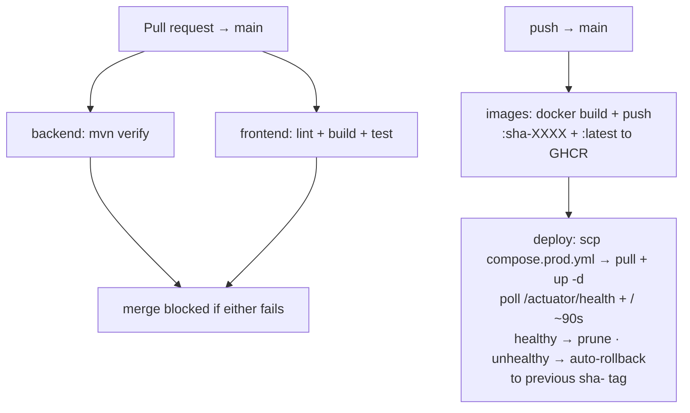

Manual redeploy/rollback without rebuilding: Actions → `CI / Deploy` → Run workflow →
`tag: sha-<oldcommit>` (every past build stays in GHCR). Full VPS/secret/rollback/ops
detail lives in `docs/deployment-guide.md` (automated + SFTP + systemd + registry-free paths).

---

## 28. Debuggability & maintainability rules

AI-written code rots fast unless these hold — they are non-negotiable:

- **Explicit over clever.** Plain loops over dense one-liners.
- **Small functions, single responsibility.** Needs "and" to describe → split it.
- **Structured logging at every state transition** (line added, doc approved, claim
  closed) with `org_id`, `branch_id`, document/line ID — one transaction traceable
  end-to-end from logs alone.
- **Errors always name what failed** — entity, ID, org. Never bare "an error occurred".
- **Every non-obvious business rule gets a why-comment** (e.g. receipts self-close at
  pending=0; verification does NOT close them).
- **Tests as documentation** — behaviour-named tests (see §24).
- **No premature abstraction.** Second real use case earns the abstraction.
- **One name per concept, everywhere** (`settlementLine` never `paymentLine`).
- **Commit messages state what changed and why**, one line (`git log` = changelog).
- **Every API error carries a request ID** that also appears in the server log line.

---

## 29. UI reference mockups

Three HTML mockups in `intial ui prototypes/` are the source of truth for layout, flow,
field names and interaction — the real frontend matches them closely:

- **`cashier-home.html`** — Cashier: universal search, customer history with Add Payment
  (appends a line), Receive Entry, Expense Entry, "View Receipts".
- **`review-close.html`** — Accountant + FM: review queue, verify/override/query/reject,
  claim closing with final override, overview panel when nothing is selected.
- **`owner-dashboard.html`** — Owner: branch comparison, drill-downs, outstanding claims,
  Team & Branches admin.

Demo conveniences in the mockups that are **not** features: the review Role toggle and
the hardcoded logged-in personas. The real system has no toggle (one account = one
role; want both views = two accounts) and a standard email+password login gate.

---

## 30. Reverification smoke checklist (per role)

Fixed click-path — use after every significant change:

- **Cashier** (`cashier@jjmotors.demo`): login → Home search finds seeded customer →
  history → Add Payment appends a line to the existing open Receive doc (no second doc) →
  New Receipt / New Expense create → Cash page drawer = `Opening + cash receipts +
  Cash In − cash expenses − Cash Out` → Close Cash with counted amount (variance +
  mandatory remark when ≠ 0 locks the date) → My Entries shows today+recent with queried
  highlighted → queried item opens in edit mode → Resubmit → SUBMITTED.
- **Accountant** (`accountant@jjmotors.demo`): queue lists SUBMITTED in OOB+OOR only →
  verify moves receipt to FM approval (receipt does NOT close) → override writes trail
  row (provisional) → query/reject with reason → close an Expense explicitly → set a
  branch's first-ever opening.
- **Finance Manager** (`finance@jjmotors.demo`): FM queues (receipts incl. open/recently-
  closed claims, expenses, cash) → approve → close a Warranty/AMC/CG claim with final
  override → record shows "Overridden · Final" → Override Audit lists who/when/
  original→new/reason/doc-line.
- **Owner** (`owner@jjmotors.demo`): Dashboard KPIs never include Cash In/Out →
  branch comparison drill-downs → Team & Branches (add branch/user, role-conditional
  assignment; multi-branch cashier toggle default OFF) → Masters CRUD deactivates, never
  deletes → Override Audit visible.
- **Super Admin** (`dams@jjsoftware.com`): Organizations list → onboard org + first Owner
  via email invite (not temp password) → invite link (`/accept-invite`) sets password →
  no transactional data visible by default.
- **Guards on every pass:** JWT role/`org_id` drives every view (no toggle, `/login` the
  only public screen); `org_id` filtering intact (`CrossOrgIsolationTest` green);
  maker-checker holds (cannot verify/approve own create/last-modify); IDs gap-free/
  sequential/never reused; no applied migration edited; `git diff` contains only the task.

---

## 31. Troubleshooting

| Symptom | Likely cause → fix |
|---|---|
| Backend 401 on every call | JWT expired (8h; `local` profile = 30d) → log in again; check `JWT_SECRET` matches the issuer |
| Bounced to `/login?expired=1` | Same — session token expired by design (no refresh in v1) |
| Swagger Authorize has no field | Fixed by `OpenApiConfig` (`bearerAuth`) — pull latest; paste the raw token, not `Bearer …` |
| Flyway checksum / validation error | An applied migration was edited (forbidden) → revert the edit; new change = new `V23__…` migration |
| `CrossOrgIsolationTest` fails locally | Docker not running (Testcontainers needs it) → start Docker; always runs in CI |
| Dashboard reads ₹0 / MTD empty | Seed dates landed in the previous month → run `SEED_TOPUP=1 node scripts/seed-demo.mjs`, or add current-month data |
| Cashier 403 on `POST /cash/opening` | Correct — only Accountant sets the first-ever opening |
| 409 naming two branches on receipt/expense create | Cross-branch write block (cashier posts under home branch only) — use the right login or move the job card |
| 409 on cash-mode line dated into a closed day | Cash-day lock (`CashDateLock`) — closed dates reject cash-mode adds/edits/deletes; non-cash lines are fine |
| Attachment signed URL 404/expired | Local provider link expired (10 min) or `public-base-url` points at the frontend → re-list and use the fresh View link; check `DAMS_STORAGE_LOCAL_PUBLIC_BASE_URL` |
| Frontend calls wrong backend | `VITE_API_URL` is baked at build time → rebuild the frontend image with the right `--build-arg`; runtime env won't change it |
| Slow clicks from India (~80–100ms/round-trip to Singapore Neon) | Known: batch queries + fixed Hikari pool already applied (see plan.md rev 15/20); further create-path batching is a deferred opt-in |
| `npm ci` fails on fresh clone | `package-lock.json` missing → `npm install` once and commit the lockfile |

---

## 32. Repo layout

```text
backend/    Spring Boot (Java 21, Maven, Flyway) — see §20
frontend/   React 18 + Vite + TypeScript — see §19
.github/    CI: build + test on PR; build & push images to GHCR on merge to main; deploy + auto-rollback
deploy/     bootstrap-vps.sh, dams.env.example, nginx-dams.conf
docs/       deployment-guide.md, VALUE_ADDITIONS.md (FEAT-01→21), RESPONSIVE_OVERHAUL_PLAN.md
scripts/    seed-demo.mjs (repeatable API-driven demo seed + SEED_TOPUP mode)
intial ui prototypes/  cashier-home.html, review-close.html, owner-dashboard.html (UI source of truth)
docker-compose.yml      local: backend + frontend vs Neon
compose.prod.yml        prod: GHCR images, localhost-only ports, healthchecks
dams.bat                Windows one-click dev launcher
AGENT.md / plan.md      spec rulebook / chronological build log
```

---

## 33. Glossary

| Term | Meaning |
|---|---|
| DBM ID | Eicher's external job-card reference, entered manually, nullable — never an internal key |
| JC / `OOR-JC-5` | DAMS's own job card, the true anchor for a vehicle/customer's history |
| FM | Finance Manager (final approver + claim closer) |
| OOJ / OOB / OOR | Demo branches: Jeypore / Berhampur / Rayagada |
| R / E / C | Document series: Receive / Expense / Cash (`OOR-JUL26-R-021`) |
| B2B / GST | Business-customer flag + GST number on the job card (`gst_no` mandatory when `is_b2b`) |
| AMC / CG / WIP | Annual Maintenance Contract / Company Goodwill / Work In Progress (claim-flavoured categories/statuses) |
| Pending Amount | Job-card-wide `invoice − Σ received lines` (0 with no invoice or a closed claim) |
| Drawer | Branch cash in hand: `Opening + cash receipts + Cash IN − cash expenses − Cash Out` |
| QUERIED / REJECTED | Returned for fix-and-resubmit / terminal refusal (both carry a note/reason) |
| Overridden · Final | FM's permanent claim-close override mark, shown everywhere the record appears |
| `over_limit` | Expense flag when a line exceeds its sub-category `limit_amount` — flags, never blocks |
